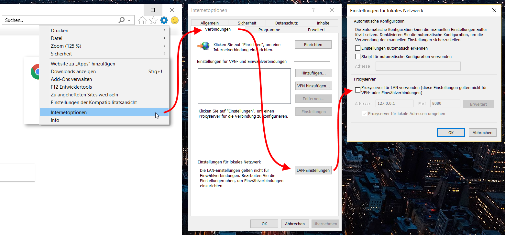

# Deprox

Deprox is a very simple tray icon app to quickly activate or deactivate the system proxy.
I needed this simple gem for a client so I decided to make it open to anyone.

Basically, all it does is to simply set or unset the checkbox in the right dialog:

**It does not change other proxy settings like its address, port or bypass list.**

## How it works

The app is setting the `ProxyEnable` setting to `0` or `1` in the Windows Registry.

That setting is located in `\HKEY_CURRENT_USER\Software\Microsoft\Windows\CurrentVersion\Internet Settings`.

Additionally, it is broadcasting two Windows messages: `INTERNET_OPTION_SETTINGS_CHANGED` and `INTERNET_OPTION_REFRESH`. With this, running apps like browsers can refresh their settings and even reload pages after the proxy was enabled or disabled. This will save you from restarting your browsers.

## How it looks

Currently, this is very basic. There's a switch icon in the system tray next to the system clock. By clicking that icon, the state can be toggled and will change from ...

 *(proxy will not be used)*

... to ...

 *(proxy will be used)*

## Credits
The app icon was made by <a href="https://www.s-ings.com" title="Stephen Hutchings">Stephen Hutchings</a> from <a href="https://www.s-ings.com/typicons/" title="s-ings.com">www.s-ings.com</a>.

The on/off tray icons were made by <a href="http://www.becrisdesign.com/" title="Becris">Becris</a> from <a href="https://www.iconfinder.com/becris" title="IconFinder">www.IconFinder.com</a>.
